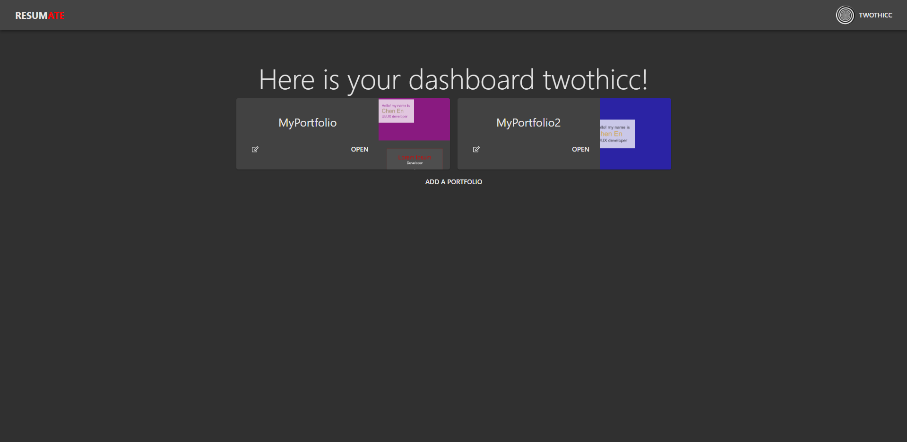
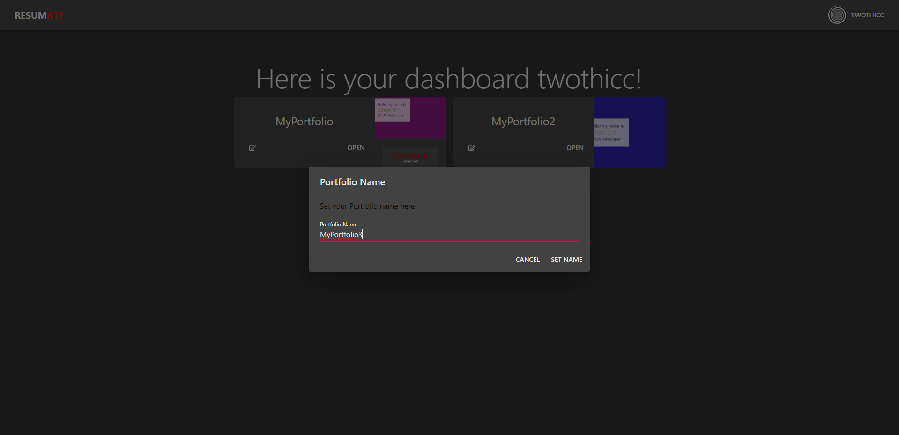
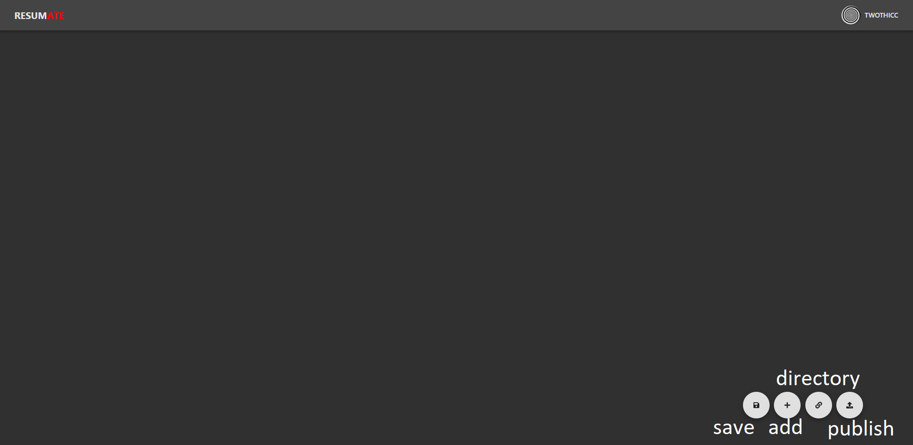
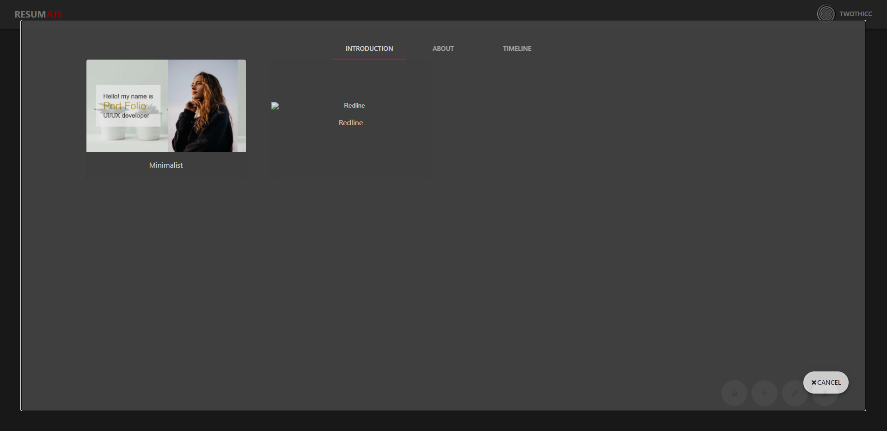
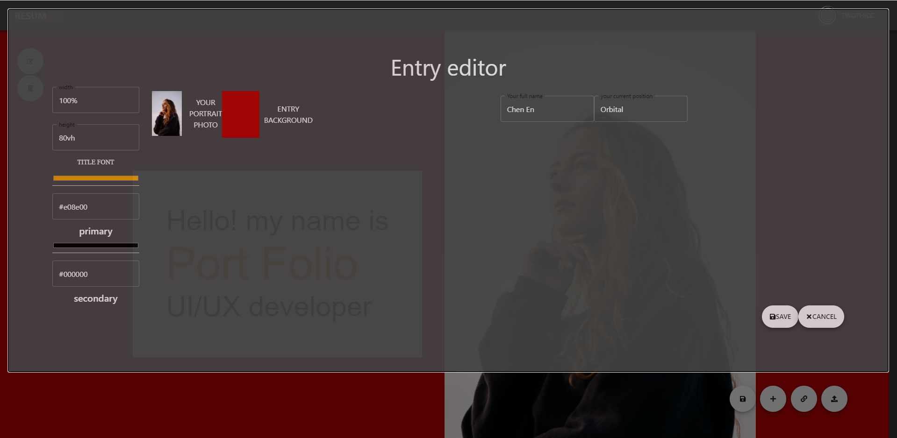
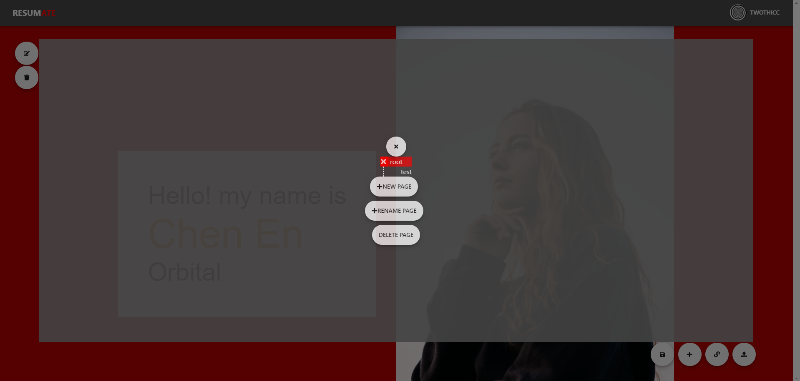
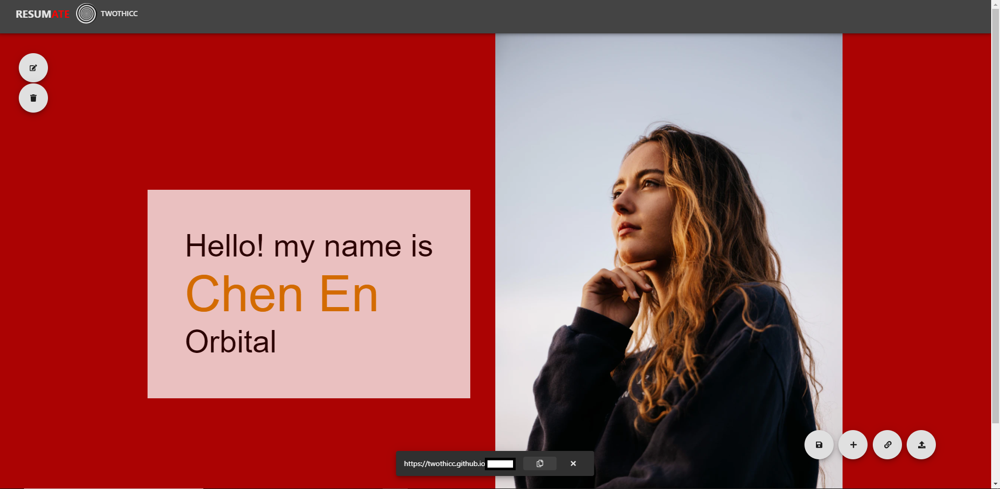
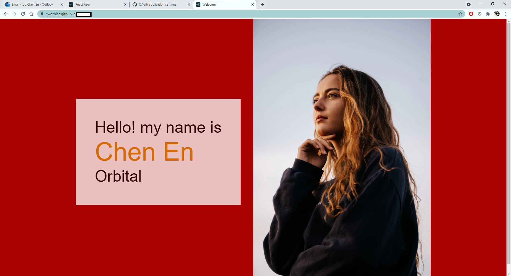

# Portfol.io

This is a MERN application that aims to simplify the creation of Portfolio websites for users.

## Proposed level of achievement

Artemis

## Motivation

Building a **personal website** can seem daunting, and many people are put off from the fact that it requires **programming experience** and design know how. 
However, having personal portfolio websites can really make individuals **stand out** from the crowd, giving them the attention they deserve. 
Our project aims to act as a middleman, helping job seekers convert their resumes into interactive, appealing personal portfolio websites that will impress their hopeful employers. 

## Aim

We hope to make a website portfolio generator to **convert** resumes into **customizable** web pages that we will also facilitate in **bringing online**. 
Themes and pre-sets will be further provided to give the website a professional look and feel.

## User Stories

1. As a student who has little experience in web development and programming, I want to have a personal website so I can better showcase my skills and track record.

2. As a graduate I want to be able to easily update my personal websites to reflect what I have done recently.

3. As a job seeker I want to better impress my employers and stand out from the other applicants.

## Scope of project

The Portfol.io web application provides an interface for users to login via Github and grant us permissions to make changes to their Github repositories. We
aim to leverage on Github Pages to help users build their very own Portfolio website, which will be hosted for free via Github Pages.

## What separates us from similar platforms?

* Completely free hosting of user's portfolio account using Github Pages.

* Fully automated process to create user's portfolio website. The User only has to make the design decisions.

* Users have full control over their websites, with no watermarks or restrictions.

* Resources will be provided for users to learn more about web development, after which their projects can be hosted on the portfolio website as well.

## Program flow

### Network Design

### Login Flow

### Portfolio Creation Flow

### Logout Flow

## Features

1. The user's Portfolio component can be rendered into HTML and CSS files. We will build the Javascript file to enable the same functionality that the user's Portfolio
site has as well as to define routing. This can then be pushed to a Github repository of the user's choice. The Github repository can then be deployed to Github Pages as 
a functioning website. With the help of Github API and OAuth, the above process can be done automatically, leaving only design to be done by the user.

2. Using Amazon EC2 instance to host our MERN application allows us to handle a decent number of requests simultaneously and ensures faster application load times compared
to Heroku. Heroku runs applications via dyno and actually puts the dyno to sleep if the application is inactive for 30 mins to save on the dyno's runtime hours. However, this
means that once the dyno goes to sleep, it takes a long time to start it again, leading to very slow application loading times. 

3. No sensitive data, such as the user's Github account password is stored or passed around. Access token is encrypted using strong algorithm and stored in a session in the database. Only
the session _id is given to the user in a secure, httpOnly, same-site and signed cookie. Secure ensures that the cookie is only sent to the server via https connection.
httpOnly ensures that the content of the cookie cannot be accessed by client-side scripts and is only accessible by the backend server. Same-site ensures that the cookie will
not be sent if the user visits the site via a third party link, which prevents a bad actor acting on the user's behalf, or a CSRF attack. Signed ensures that if the cookie's contents
are tampered with, it will be known and an error will be raised. 

4. User peripherals, logged in status and current Portfolio work will be stored in the localStorage to enable re-login and saving of current work after page refreshes or
change in browser tabs.

5. HSTS ensures that web browsers will automatically interact with the Nginx server via secure https connection only. Even if http requests make it through, the Nginx server
will redirect any http traffic to https.

## Showcase

- - - -

### Creating a portfolio and deploying a Github pages site based off of the created portfolio. 

1. To view the site in progress, you can visit https://resumate.xyz/

2. In the Home page, you will see the **Login with Github** button. Click that to be redirected to Github to login.

3. You will then have to grant the OAuth application permission to make changes to your repositories if you have not done so.

4. Once done, you will be redirected to DashBoard.

5. If you have not created any portfolio yet, click on `ADD A PORTFOLIO` button to start creating a portfolio. If you have already created a portfolio and wish to edit it,
click on the `open` button belonging to the portfolio.

6. If you clicked on `ADD A PORTFOLIO` button, you will need to pick a unique, non-empty portfolio name. 
Thereafter, you will be redirected to `/edit` path, where you can begin creating/editing your portfolio.

7. Once in the `/edit` path, you will see a panel at the bottom right with 4 buttons. Click on `+` button and you will be shown an overlay to select a template. Templates
are prebuilt components on which you can customize to suit your needs. For example, select the `Minimalist` under `INTRODUCTION` tab.

8. The Minimalist template will appear on your screen and you will see two buttons on the top left hand corner of the component. The `edit` button will open an overlay allowing you
to edit your name, current job position, colors, profile picture, etc. Edit as you like.

9. Once done editing, you can either click away from the overlay or click on `save` button on the overlay. Autosave will happen in 30s but if you wish, you may click on the `save` button
represented by the floppy disk in the bottom right panel to save immediately. If you attempt to navigate away from the page by clicking `<-` back navigator button on your browser before autosave or manual save, a dialog will pop up to prompt you to either save or discard your save.

10. `Optional`: You can add more components downwards by repeating steps 7 to 9. You can also click on the `directory` button represented by a chain link to create additional pages. Your base
page will be called `root`. For example, click on `+NEW PAGE` to create a new page called `test`, then click on the `root` button. This will expand downwards to show the `test` button.
Click on that to edit the `test` page instead, which should be an empty page for now. You may create multiple nested pages if you wish to.

11. Once satisfied with edits, remember to save again or wait for autosave. Click on the `publish` button in the bottom right panel, which will open a dialog asking you to choose
a name for the Github repository that your files will be pushed to. Once done, click on `FINALIZE` button.

12. If you have chosen an existing Github repository, another dialog will show asking for your permission to overwrite the existing Github repository. If you do not wish to overwrite, 
click on `CANCEL` button to cancel the publish operation. Otherwise, click on `ALLOW OVERRIDE` button and the publish operation will begin.

13. You will see a circular loading indicator in the `publish` button in the bottom right panel. Wait patiently while your Github page is being built. Once done, a white snackbar will
appear from the bottom of the screen, from which you can click on the `copy` button to copy the URL of your Github page to the clipboard.

14. Open a browser tab and paste in the copied URL to see your Github page.

- - - -

## Milestone 2 goals

- [x] Work on backend API routes to handle functionality that involves mongoDB

- [x] Portfolio creation flow is currently being tested in separate components and need to be combined together

- [x] User Interface has to be improved to provide a more professional look

- [x] Upgrade http to https to ensure secure connection between server and browser

- [x] Domain name would have to be acquired to obtain an SSL certificate

- [x] Development of more entry templates for the user to customize and add to their portfolio websites

- [ ] Development of web development guides for html/js/css - In Progress

- [x] Development of code editor for users to develop sub directories

## Further Development

* Development of more entry templates for the user to customize and add to their portfolio websites

* Adding functionalities to the deployed Github page site

## Documentation

Visit https://colon-wq.github.io/Portfolio/ to view documentation for Frontend React application.

Visit http://resumate.xyz/api/docs to view documentation for Backend Express application.
