# Resumate

This is a MERN application that aims to simplify the creation of Portfolio websites for users.

## Proposed level of achievement

Artemis


## Motivation

Getting started with web development can seem daunting, and many people are put off from the fact that it requires programming experience and design know-how. At the same time, getting started with programming can be discouraging since it is not easy to showcase projects without a website. As such, getting users set up with a personal website they have full control over can help jump start their programming journey while making them stand out from the crowd.

## Aim

Our project aims to help users create interactive personal websites using intuitive, simple controls that can still produce visually appealing results that will help users stand out from the crowd. Our project also aims to act as a gateway to jump start users in getting started with programming, by providing an easily extensible website that users can host their projects on. Our tutorials and resources will also serve to guide users through the learning process, ensuring that they will not feel lost.

## User Stories

1. As a student, I wish to make my portfolio interactive and appealing.

2. As a newcomer to web development, I wish to showcase my personal projects online.

3. As a job seeker I want to better impress my potential employers.

4. As a designer I wish to display my work without the restrictions of traditional resumes and portfolios.

5. As someone with no programming experience, I wish to get started with programming

6. As a programmer with no design experience I wish to make my personal website more appealing

7. As a front end developer I want a free hosting solution for my personal website without watermarks or advertising.


## Scope of project

Resumate provides an interface for users to create static pages using our provided templates and editing tools. Our project will also be able to publish the site to the user’s Github pages site via Github’s API. 

## What separates us from similar platforms?

1. Simplified editing experience, many website building services provide complex controls that can be confusing and unnecessary for our target audience.

2. No watermarks -- many available website generators overlay a watermark header over generated websites for free users.

3. No sign ups required -- login via Github, no hassle of creating a new account for our service, unlike most website builders.

4. No full stack architecture required -- generated pages are static, and there is no need for server back ends.

5. Easily saved -- static pages can be downloaded, edited and viewed offline.

6. Do it yourself -- resources provided for users to get started with web development, users can easily upload their own projects to add pages and functionality to their websites.

7. Full control -- Users own the generated github repository, which is independent of resumate.


## Program flow

**Note**: The legends help to showcase in general which server is performing the tasks.

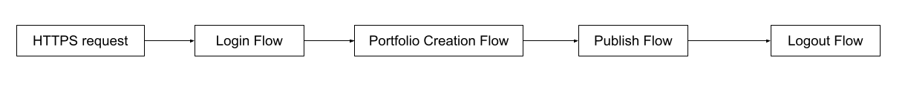

### Network Design

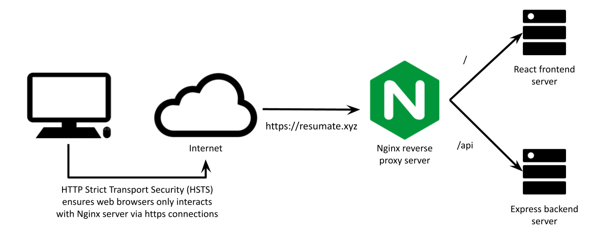

### Login Flow


### Portfolio Creation Flow

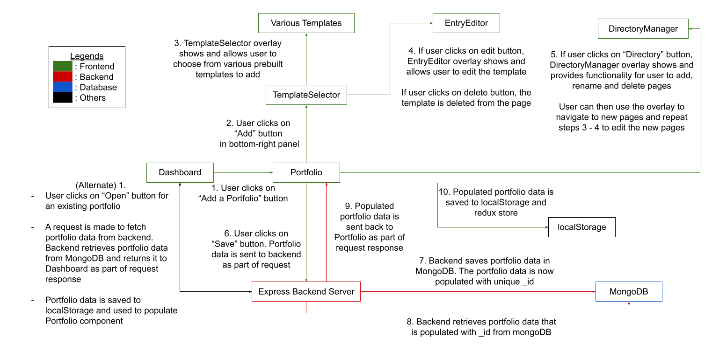

### Publish Flow

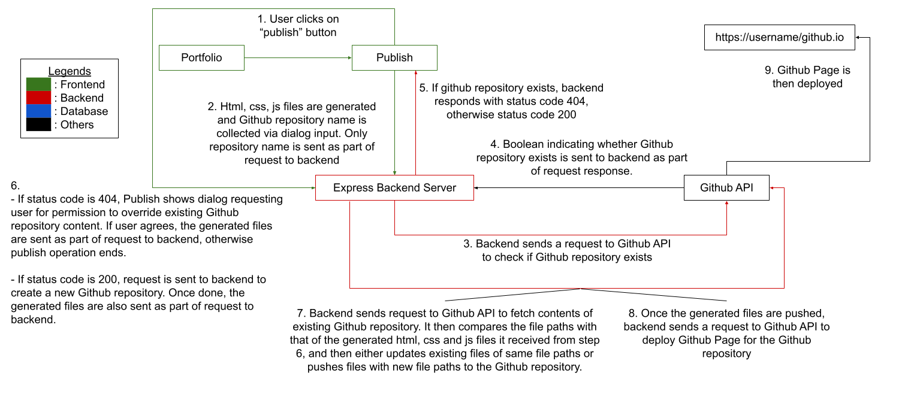

### Logout Flow

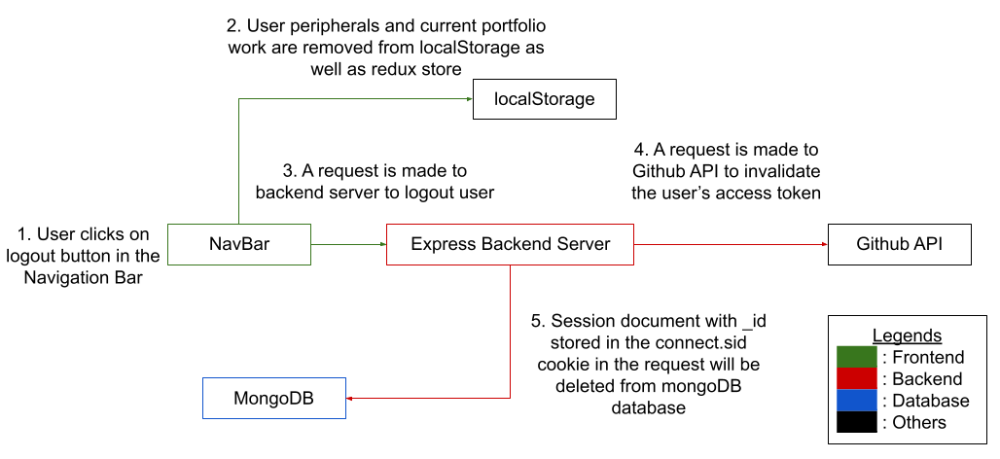

## Features

### Key features

1. Simplified editor controls CRUD

2. Static page generation

3. Secure data transfer and storage

4. Automated publishing/hosting

### Access Control

1. Github login with OAuth authorization code

2. httpOnly, same-site secure cookies containing encrypted JSON Web Tokens as refresh token/ user verification

3. localStorage login state

4. HSTS for https redirection on Nginx server

### Editing tools

1. Material UI components

2. Template selection UI

3. Template defined editable fields

4. Directory management tools for sub directories

5. Local file upload

6. Preview thumbnail generation

### Publishing tools

1. Autosave in localStorage

2. Portfolio saving with MongoDB

3. Static page generation with ReactDOMServer and Material UI stylesheets

4. Backend publishing routes via Github API

5. Repository checks to prevent accidental overrides


## Future Additions

1. Image gallery with Pexels API

2. Local directory links

3. Email contacts with Formspree API

4. Guest login without Github

5. Programming tutorials/resources

## User Guide

### Authenticating via github

1. Navigate to https://resumate.xyz/

2. Click GET STARTED button

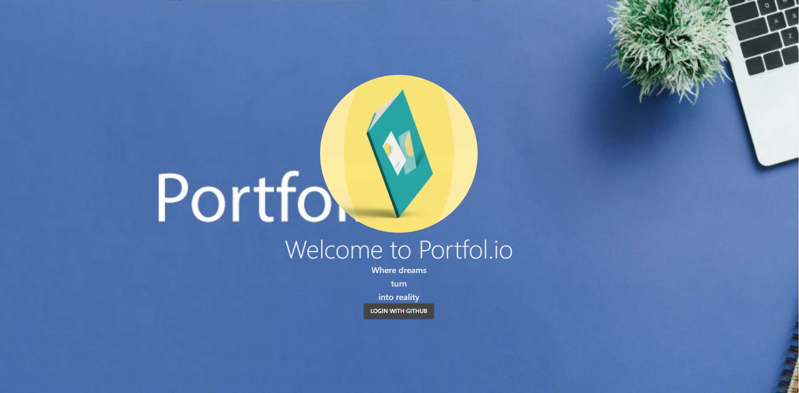

3. You will be automatically redirected to Github API’s login callback, after which click authorize to continue.

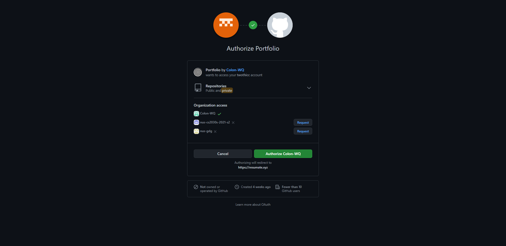

4. Once done, you will be redirected to DashBoard.

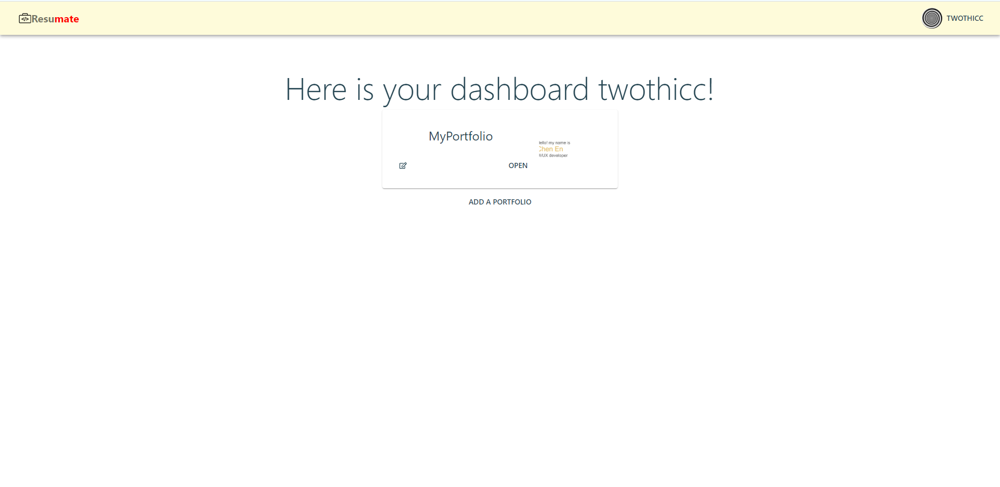

### Editing your portfolio

1. Once in Dashboard, 
    * If you are a new user, you’ll likely see no existing Portfolios. Click on “Add a Portfolio” button to create one. You will need to provide a unique and non-empty name for your new portfolio, after which you will be redirected to your Portfolio page.
    * If you are an existing user, you may have existing Portfolios. To edit existing Portfolios, click on “open” button. You will be redirected to your Portfolio page.


2. Once in Portfolio page,
    * If this is a new portfolio, you’ll see a blank background.
    * If this is an existing portfolio, you’ll see the page populated with the portfolio’s past entries.

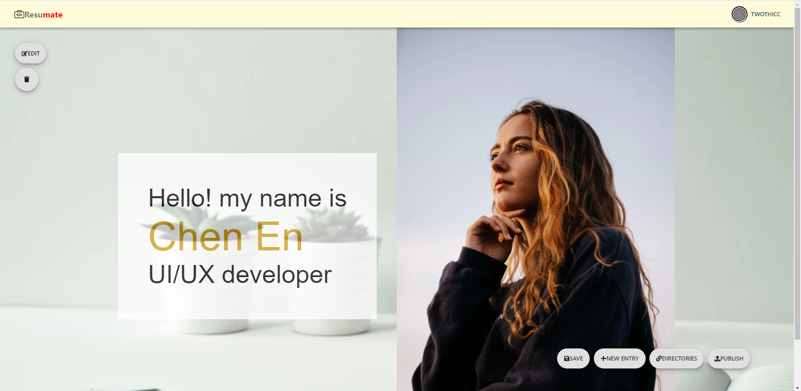

3. At the bottom left of the screen, there will be a panel of buttons. Click on “Add” button to choose a template.

4. An overlay will show, allowing you to pick a prebuilt component to add to your Portfolio. For this example, introduction minimalist template will be chosen.

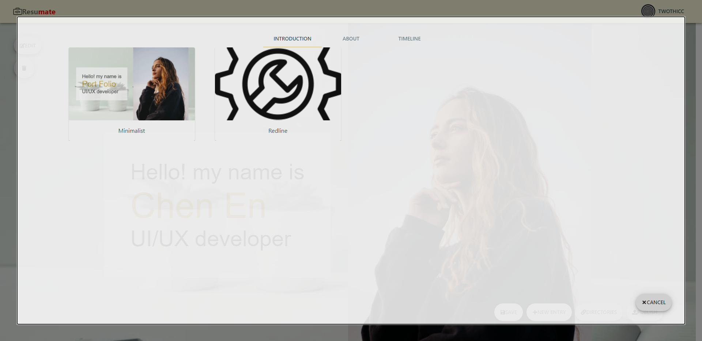

5. Once the template is chosen, the component will show up on your screen, with two buttons on its top left. Click on the “Edit” button.

6. An overlay will show, allowing you to change various aspects of the template. Click on whichever property you wish to change.

7. Once done with editing, click away from the editor or click “save” icon. The overlay button will close and autosave will begin in 30s or you may choose to manually save by clicking the “save” button in the bottom right panel.

Should you choose to navigate away from the portfolio page via back button or via navigation bar, an alert prompt will show, asking you to either discard unsaved work or save before leaving.

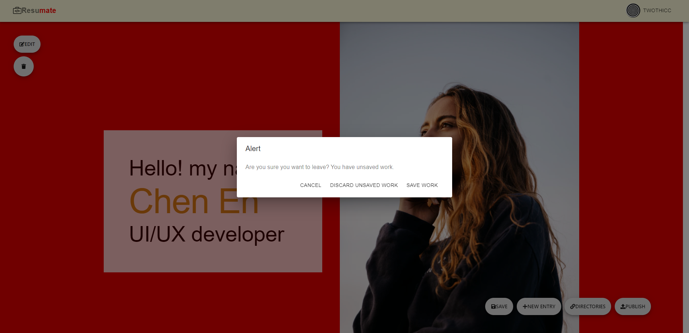

8. To create new pages, click on the “link” icon in the bottom right panel and an overlay will show up with a “root” button in the center. This “root” button represents the homepage of your website. Select the page to add the directory to, namely root, and select “new page”. 

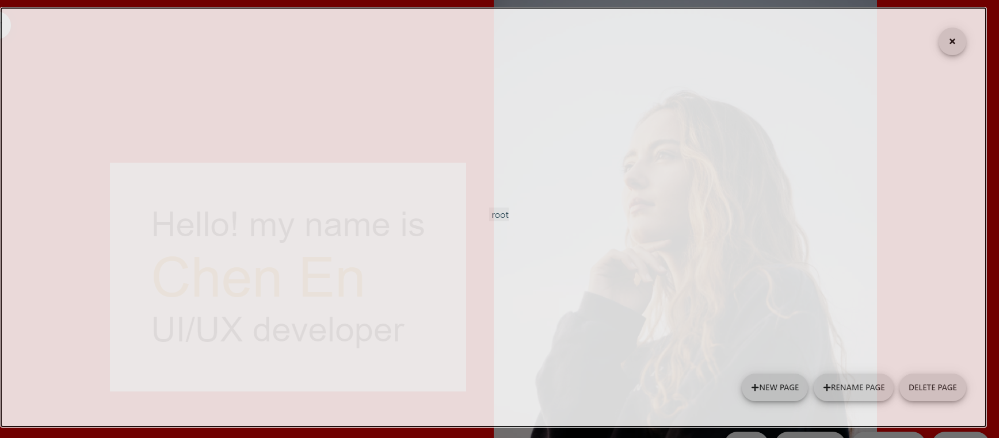

9. Click the “+” icon on the left side of root to open its subdirectories. Select the directory you wish to edit and close the directory selector to open the page.

### Publishing your portfolio

1. In the Portfolio page, click on the “publish” button in the bottom right panel. You will be asked to input the name of the Github repository you wish to push your portfolio files to.

Take note, this name will be part of your portfolio website url, so choose a suitable name.

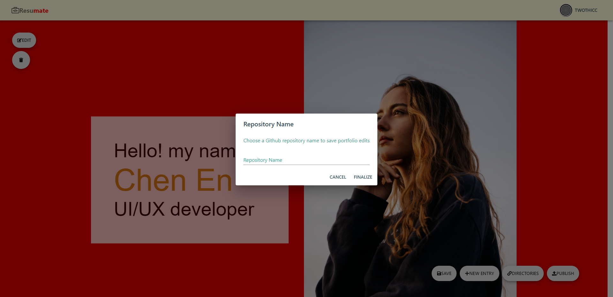

2. Once done, click on the “finalize” button and the publish operation will begin.

If you have chosen a name matching the name of a Github repository that you already have, another dialog will show asking you for permission to overwrite the existing Github repository. If you do not wish to overwrite, click on the “cancel” button to cancel the publish operation. Otherwise, click on the “allow override” button and the publish operation will begin.


3. Once done, a snackbar will appear from the bottom of the screen, from which you can click on the copy button to copy the URL of your Github page to the clipboard.

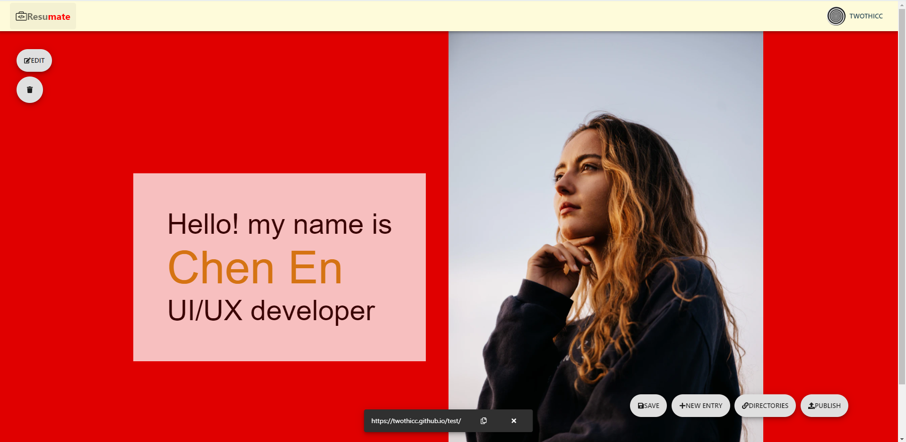

4. Open a browser tab and paste in the copied URL to see your Github page.

### Deleting your portfolio

1. In the Dashboard, click on the edit button of your existing portfolio. The edit button will expand, showing the “delete” and “change” name button.

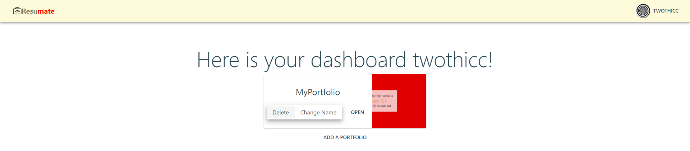

2. Click on “delete” button. A dialog will show asking you to confirm the delete. Click on “cancel” if you wish to cancel the delete operation. Otherwise, click on “delete” to proceed with delete operation. Your portfolio will be deleted.
	
**Note**: Recovery will not be possible after deletion.

- - - -

## Evaluation of usability

1. Acquaintances, both with and without computing experiences, were asked to try out the prototypes

2. People, both with and without experience in using website builders, were asked to provide feedback on other available website builders and why or why not they used those services.

## Development testing

1. SSL Trust used for security testing

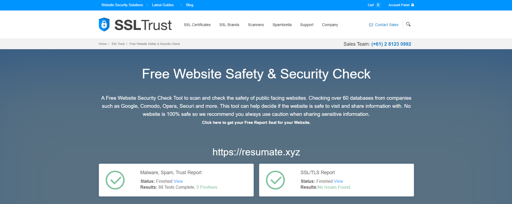

No issues found in Malware/spam/trust report, SSL/TLS report. You may run the same test for the website here https://www.ssltrust.com.au/ssl-tools/website-security-check.

2. Postman used to test backend routing requests


## Documentation

Visit https://colon-wq.github.io/Portfolio/ to view documentation for Frontend React application.

Visit http://resumate.xyz/api/docs to view documentation for Backend Express application.

## Setup for local testing

Prerequisites: 

* Your own Github OAuth application
    * You can follow this guide https://tina.io/guides/nextjs/github/github-oauth-app/ to set up one
* A mongodb atlas database url
    * You can follow this guide https://docs.atlas.mongodb.com/getting-started/ to set up one

1. Clone the repository and `cd` into both `client` and `server` directories. Then run 

```
npm install
```

2. `cd` into the `client` directory, create a new `.env` file and copy the fields from `.sample-env` in the same directory

    * REACT_APP_CLIENT_ID is the client id of your Github OAuth application
    * REACT_APP_BACKEND is http://localhost:5000/api
    * REACT_APP_USER_LOCALSTORAGE can be set to any name. For example, `user_store`
    * REACT_APP_AUTOSAVE_LOCALSTORAGE can be set to any name. For example, `portfolio_store`

3. `cd` into the `server` directory, create a new `.env` file and copy the fields from `.sample-env` in the same directory

    * CLIENT_ID is the client id of your Github OAuth application
    * CLIENT_SECRET is the client secret of your Github OAuth application
    * REDIRECT_URI is the URI that your Github OAuth application redirects users to. It should be set to http://localhost:3000/login/callback
    * JWT_SECRET can be any random string
    * SIGN_COOKIE_SECRET can be any random string
    * FRONT_END is http://localhost:3000
    * BACK_END is http://localhost:5000/api
    * MONGO_URL is your mongodb atlas database url
    * ENCRYPT_KEY can be any random string

4. Then `cd` into the root directory. Then run

```
npm run dev
```
