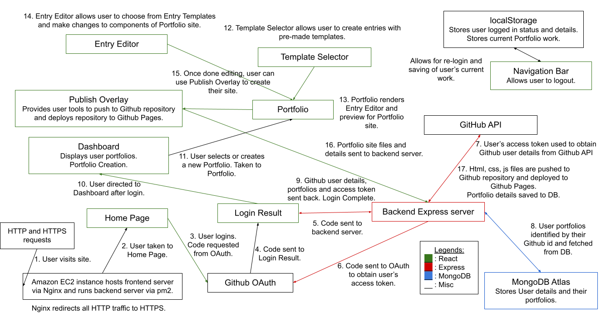

# Portfol.io

This is a MERN application that aims to simplify the creation of Portfolio websites for users.

## Proposed level of achievement

Artemis

## Motivation

Building a **personal website** can seem daunting, and many people are put off from the fact that it requires **programming experience** and design know how. 
However, having personal portfolio websites can really make individuals **stand out** from the crowd, giving them the attention they deserve. 
Our project aims to act as a middleman, helping job seekers convert their resumes into interactive, appealing personal portfolio websites that will impress their hopeful employers. 

## Aim

We hope to make a website portfolio generator to **convert** resumes into **customizable** web pages that we will also facilitate in **bringing online**. 
Themes and pre-sets will be further provided to give the website a professional look and feel.

## User Stories

1. As a student who has little experience in web development and programming, I want to have a personal website so I can better showcase my skills and track record.

2. As a graduate I want to be able to easily update my personal websites to reflect what I have done recently.

3. As a job seeker I want to better impress my employers and stand out from the other applicants.

## Scope of project

The Portfol.io web application provides an interface for users to login via Github and grant us permissions to make changes to their Github repositories. We
aim to leverage on Github Pages to help users build their very own Portfolio website, which will be hosted for free via Github Pages.

## What separates us from similar platforms?

* Completely free hosting of user's portfolio account using Github Pages.

* Fully automated process to create user's portfolio website. The User only has to make the design decisions.

## Program flow

## Features

1. The user's Portfolio component can be rendered into HTML and CSS files. We will build the Javascript file to enable the same functionality that the user's Portfolio
site has as well as to define routing. This can then be pushed to a Github repository of the user's choice. The Github repository can then be deployed to Github Pages as 
a functioning website. With the help of Github API and OAuth, the above process can be done automatically, leaving only design to be done by the user.

2. Using Amazon EC2 instance to host our MERN application allows us to handle a decent number of requests simultaneously and ensures faster application load times compared
to Heroku.

3. No sensitive data, such as the user's Github account password is stored or passed around.

4. User peripherals, logged in status and current Portfolio work will be stored in the localStorage to enable re-login and saving of current work after page refreshes or
change in browser tabs.

## Showcase

- - - -

### Pushing to Github repository and deploying the repository to Github Pages.

1. To view the site in progress, you can visit http://13.228.174.76/

2. In the Home page, you will see the **Login with Github** button. Click that to be redirected to Github to login.

3. You will then have to grant the OAuth application permission to make changes to your repositories if you have not done so.

4. Once done, you will be redirected to DashBoard.

5. Click on test Publish to be taken to the Publish Overlay, where you will see a Publish button on the bottom right.

6. Click on it to expand the menu. Click on **Finalize and Push** to spawn a dialog prompting you to input a Github repository name.

7. You will also be prompted to add a file. For example, input `index.html` for file name and `<h1>hello world!</h1>` for file content

8. If you choose to input a repository name that you do not have and click on **Finalize**, a new Github repository will be created for you. The index.txt file
will be pushed to the Github repository and that repository will be deployed to Pages. 

9. Visit https://`USERNAME`.github.io/`REPOSITORYNAME`/ where USERNAME and REPOSITORYNAME should be replaced by your Github username and Github repository name respectively.

10. Once done, remember to click the profile on the top right of the navbar, then click the **logout** button to invalidate your access token and delete the cookie containing
the access token.

- - - -

### See the Editor in testing.

1. To view the site in progress, you can visit http://13.228.174.76/

2. In the Home page, you will see the **Login with Github** button. Click that to be redirected to Github to login.

3. You will then have to grant the OAuth application permission to make changes to your repositories if you have not done so.

4. Once done, you will be redirected to DashBoard.

5. Click on **Create a Portfolio** to be taken to a selection page, click on the floating **+** button at the bottom right.

6. You will be shown 3 templates. Click on any template and you will be shown a preview of the template component.

7. There will be an **edit** icon on the top left with which you can edit parts of the template. It is under development.

8. Once done, remember to click the profile on the top right of the navbar, then click the **logout** button to invalidate your access token and delete the cookie containing
the access token.

## Further Development

* Work on backend API routes to handle functionality that involves mongoDB.

* Portfolio creation flow is currently being tested in separate components and need to be combined together.

* User Interface has to be improved to provide a more professional look.

* Upgrade http to https to ensure secure connection between server and browser.

* Domain name would have to be acquired to obtain an SSL certificate.

* Development of more entry templates for the user to customize and add to their portfolio websites.

## Documentation

Visit https://colon-wq.github.io/Portfolio/ to view documentation for Frontend React application.

Visit http://13.228.174.76:5000/docs to view documentation for Backend Express application.
